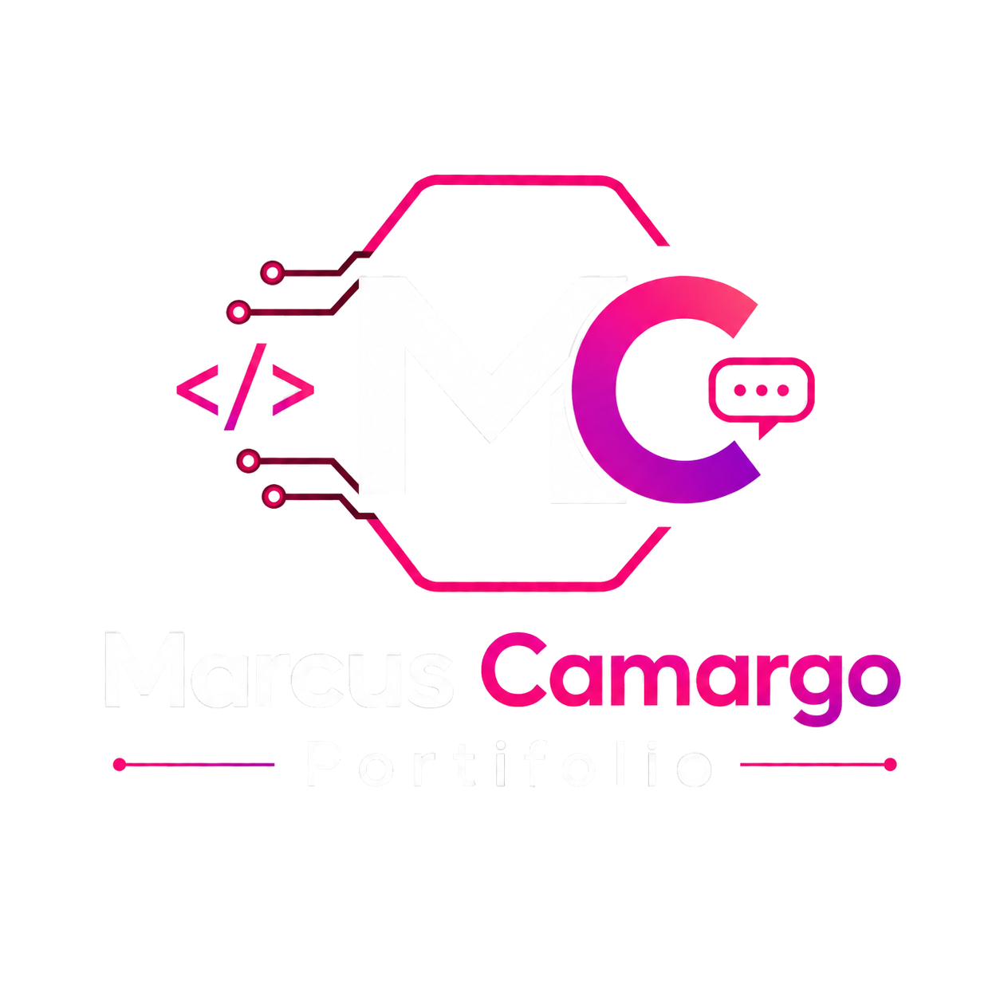

<p align="center">
  
</p>

# 💻 Marcus Camargo | Portfólio

> Portfólio profissional para apresentar projetos reais, serviços de desenvolvimento e canais de contato.  
> Professional portfolio for showcasing real projects, development services and contact channels.

[](https://react.dev/)
[](https://www.typescriptlang.org/)
[](https://vite.dev/)
[](https://vercel.com/)
[](#responsividade-e-experiencia)

---

<a id="portugues"></a>

## 🇧🇷 Português (Brasil)

### Sobre o projeto

**Marcus Camargo | Portfólio** é meu site profissional para reunir, em um único lugar, minha apresentação, os serviços que desenvolvo, projetos reais já publicados e os principais canais de contato para contratação.

O portfólio possui dois objetivos complementares:

- **apresentação comercial:** facilitar o contato de pessoas, profissionais e pequenos negócios interessados em sites, aplicações web, integrações, automações e chatbots;
- **apresentação técnica:** permitir que recrutadores, avaliadores e outros profissionais conheçam meus conhecimentos através de projetos reais, interfaces publicadas, tecnologias utilizadas e soluções efetivamente desenvolvidas.

Em vez de funcionar apenas como uma página estática de apresentação, o site foi estruturado para evoluir junto com meu trabalho. Cada projeto concluído pode ser incorporado à área de projetos com uma representação gráfica própria, descrição das funcionalidades, tecnologias utilizadas e acesso direto à aplicação publicada.

---

### Objetivos do portfólio

O projeto foi desenvolvido para:

- apresentar minha identidade profissional e área de atuação;
- demonstrar conhecimentos de frontend, responsividade, integração com APIs, bancos de dados e automações;
- reunir projetos publicados em uma vitrine única;
- apresentar visualmente as aplicações antes que o visitante abra o projeto real;
- direcionar visitantes para os sistemas em produção;
- oferecer canais diretos de contato para contratação de serviços;
- disponibilizar meu GitHub para análise de código e repositórios públicos;
- servir como material profissional para processos seletivos, avaliações técnicas e networking;
- acompanhar minha evolução profissional através da inclusão contínua de novos projetos.

---

### Tecnologias

| Camada | Tecnologia | Função |
| --- | --- | --- |
| Interface | React 19 | Componentes e estrutura da página |
| Linguagem | TypeScript 5.8 | Tipagem e manutenção do frontend |
| Build | Vite 7 | Ambiente de desenvolvimento e build de produção |
| Estilização | CSS | Layout, identidade visual, animações e responsividade |
| Ícones | Lucide React | Ícones da interface e ações |
| Hospedagem | Vercel | Publicação do portfólio |
| Integrações externas | Links para projetos, GitHub, WhatsApp e Instagram | Navegação para aplicações e canais profissionais |

---

### Estrutura da página

#### Início / Hero

A primeira seção apresenta de forma direta o foco do meu trabalho: **sites, sistemas, automações e chatbots**.

Ela reúne:

- mensagem principal de apresentação;
- resumo da proposta profissional;
- botão para acessar os projetos;
- botão **Fale comigo** para direcionar à área de contato;
- acesso direto aos meus repositórios públicos no GitHub;
- cards de destaque para Web, Apps e IA;
- identidade visual com a logomarca do portfólio.

O objetivo é permitir que um visitante entenda rapidamente o tipo de solução que desenvolvo e escolha entre conhecer os projetos ou entrar em contato.

#### Identidade

A seção de identidade apresenta a linguagem visual utilizada no portfólio e reforça a associação entre minha marca, tecnologia e desenvolvimento de soluções digitais.

Ela utiliza uma composição gráfica própria, integrada ao mesmo padrão de cores, tipografia e elementos visuais do restante da página.

#### Serviços

A área de serviços apresenta as principais frentes em que posso atuar profissionalmente:

- **Sites profissionais:** landing pages, páginas institucionais e interfaces responsivas;
- **Aplicações web:** sistemas online, autenticação, bancos de dados e fluxos personalizados;
- **Integrações & APIs:** conexão entre serviços, APIs, bancos de dados e automações;
- **Chatbots:** criação e configuração de soluções para atendimento, suporte e otimização de processos.

Essa seção transforma o portfólio também em uma página de apresentação comercial dos serviços disponíveis.

#### Projetos em destaque

A seção de projetos é a principal vitrine técnica do site.

Cada projeto possui:

- uma **representação gráfica responsiva** inspirada na interface real;
- adaptação visual específica para desktop e dispositivos móveis;
- nome do projeto;
- tecnologias principais;
- resumo das funcionalidades;
- botão para abrir a versão publicada em uma nova guia.

Os previews não tentam executar uma segunda cópia completa das aplicações dentro do portfólio. Eles funcionam como representações visuais fiéis, permitindo que o visitante reconheça a identidade e o tipo de experiência antes de acessar o projeto real.

#### Sobre meu trabalho

A seção **Sobre** explica de forma mais detalhada minha abordagem de desenvolvimento.

Ela destaca a criação de soluções para pequenos negócios, profissionais e projetos personalizados, incluindo páginas responsivas, sistemas online, integrações, bancos de dados, autenticação, automações e chatbots.

Para recrutadores e avaliadores, essa área complementa os projetos ao contextualizar quais tipos de problemas e necessidades procuro resolver com tecnologia.

#### Contato

A seção final concentra os canais utilizados para conversas profissionais e contratação:

- **WhatsApp Business:** contato direto para serviços e propostas;
- **Instagram:** conteúdo, apresentação e contato profissional.

O site também oferece acesso ao meu **GitHub**, permitindo que recrutadores, desenvolvedores e avaliadores consultem meus repositórios públicos e acompanhem os projetos pelo código-fonte.

---

<a id="responsividade-e-experiencia"></a>

### Responsividade e experiência

O portfólio foi desenvolvido para manter sua identidade e conteúdo em diferentes tamanhos de tela.

#### Desktop

Em monitores e notebooks, a página utiliza composições horizontais maiores, cards distribuídos em múltiplas colunas e previews dos projetos próximos às proporções das respectivas experiências desktop.

#### Mobile

Em celulares, o site possui comportamento específico em vez de apenas reduzir a versão desktop:

- cabeçalho compacto com menu mobile;
- seções reorganizadas verticalmente;
- botões e conteúdos adaptados à largura disponível;
- cards de destaque ajustados para leitura em telas menores;
- previews dos projetos convertidos para uma apresentação vertical;
- simulação mobile do **Letreiro** com teclado redimensionado e posicionado próximo ao rodapé da tela emulada;
- simulação mobile do **Liste & Compre** reorganizada de acordo com a experiência vertical da aplicação real.

Essa abordagem reduz cortes de conteúdo e evita que o visitante veja no portfólio uma experiência incompatível com o layout que encontrará ao abrir os projetos em seu próprio dispositivo.

---

### Projetos atualmente integrados

#### 🎬 Letreiro

**Letreiro** é um jogo diário de descoberta de filmes. O jogador precisa identificar o título do dia através de tentativas, letras coloridas e dicas progressivas.

Principais recursos apresentados no portfólio:

- jogo diário;
- teclado virtual;
- dicas de estúdio e categoria;
- temas claro e escuro;
- calendário de partidas anteriores;
- persistência local;
- integração com Supabase e TMDB;
- automação diária através do GitHub Actions.

O preview do portfólio reproduz elementos visuais do tabuleiro, dicas, teclado e os dois temas da aplicação.

🌐 **Abrir projeto:** [letreiro-cine-puzzle.vercel.app/pt-br](https://letreiro-cine-puzzle.vercel.app/pt-br)

📦 **Repositório:** [Marcus-W-Camargo/Letreiro](https://github.com/Marcus-W-Camargo/Letreiro)

#### 🛒 Liste & Compre

**Liste & Compre** é uma aplicação web para organizar listas de compras, acompanhar uma compra em andamento e consultar o histórico posteriormente.

Principais recursos apresentados no portfólio:

- criação e gerenciamento de listas;
- produtos organizados por categorias;
- quantidade por unidade ou quilograma;
- autenticação e dados por conta;
- acompanhamento de preços e compras;
- histórico de compras;
- interface responsiva para desktop e celular;
- integração com Supabase e serviços publicados na Vercel.

O preview utiliza uma representação inspirada diretamente na tela real de criação de listas, incluindo identidade visual, cards, formulário, itens e controles. No mobile, a composição é reorganizada para refletir melhor o formato vertical utilizado pela aplicação.

🌐 **Abrir projeto:** [liste-e-compre.vercel.app](https://liste-e-compre.vercel.app/)

📦 **Repositório:** [Marcus-W-Camargo/liste-e-compre](https://github.com/Marcus-W-Camargo/liste-e-compre)

---

### Integração entre o portfólio e os projetos

O portfólio funciona como uma camada de apresentação para os demais projetos publicados.

O fluxo esperado é:

1. o visitante conhece minha apresentação e áreas de atuação;
2. navega até **Projetos em destaque**;
3. visualiza uma representação gráfica da aplicação;
4. consulta a descrição e as tecnologias utilizadas;
5. abre o projeto real através do botão **Ver projeto ao vivo**;
6. quando necessário, pode consultar os repositórios públicos no GitHub;
7. caso exista interesse profissional, utiliza os canais de contato disponíveis no próprio portfólio.

Os projetos continuam independentes, com seus próprios repositórios, infraestrutura, bancos de dados, APIs e deploys. O portfólio não incorpora a lógica interna deles: ele apresenta cada solução e direciona o visitante à aplicação publicada.

---

### Atualizações recorrentes

Este portfólio é um projeto de atualização contínua.

Sempre que um novo projeto atingir um estado considerado pronto para apresentação pública, ele poderá ser adicionado à página seguindo o mesmo padrão dos projetos atuais.

Cada nova inclusão deverá apresentar, quando aplicável:

- nome e propósito do projeto;
- representação gráfica baseada na interface real;
- adaptação do preview para desktop e mobile;
- principais tecnologias utilizadas;
- resumo de suas funcionalidades;
- link para a aplicação publicada;
- referência ao repositório público, quando disponível.

Dessa forma, a página permanece como um registro atualizado dos projetos que concluí e das tecnologias que venho aplicando na prática.

---

### Contato profissional

- 💬 **WhatsApp Business:** [Entrar em contato](https://wa.me/message/S2FPE7ASPUHHM1)
- 📷 **Instagram:** [@marcus.camargo_portifolio](https://www.instagram.com/marcus.camargo_portifolio/)
- 💻 **GitHub:** [Marcus-W-Camargo](https://github.com/Marcus-W-Camargo)

---

### Execução local

Requisitos:

- Node.js compatível com o projeto;
- npm.

Clone o repositório e instale as dependências:

```bash
git clone https://github.com/Marcus-W-Camargo/Marcus.Camargo-Portifolio.git
cd Marcus.Camargo-Portifolio
npm install
```

Inicie o ambiente de desenvolvimento:

```bash
npm run dev
```

Para disponibilizar o servidor na rede local e testar pelo celular:

```bash
npm run dev -- --host
```

Build de produção:

```bash
npm run build
```

Pré-visualização do build:

```bash
npm run preview
```

---

### Estrutura principal

```text
src/
├─ assets/                         # Imagens, identidade visual e fotos
├─ components/
│  ├─ Header.tsx                  # Cabeçalho e navegação
│  ├─ ProjectPreview.tsx          # Representações visuais dos projetos
│  └─ SectionHeading.tsx          # Títulos reutilizáveis das seções
├─ data/
│  └─ projects.ts                 # Projetos, tecnologias e links publicados
├─ App.tsx                        # Composição principal do portfólio
├─ main.tsx                       # Entrada da aplicação e folhas de estilo
└─ *.css                          # Layout, temas, previews e responsividade
```

---

### Roadmap

- [ ] **Versão internacional do site:** implementar seleção de idioma entre **PT-BR** e **EN-US**, com um botão de troca de idioma disponível na interface e conteúdo completo do portfólio traduzido para inglês.

---

<a id="english"></a>

## 🇺🇸 English (US)

### About the project

**Marcus Camargo | Portfolio** is my professional website for bringing together my introduction, development services, published real-world projects and the main contact channels for hiring inquiries.

The portfolio serves two complementary purposes:

- **commercial presentation:** make it easier for individuals, professionals and small businesses looking for websites, web applications, integrations, automations and chatbots to contact me;
- **technical presentation:** allow recruiters, reviewers and other professionals to evaluate my knowledge through real projects, published interfaces, technologies and solutions that were actually developed.

Instead of being only a static introduction page, the website was designed to evolve alongside my work. Every completed project can be added to the projects area with its own graphical representation, feature summary, technology stack and direct link to the published application.

---

### Portfolio goals

The project was built to:

- present my professional identity and areas of work;
- demonstrate frontend, responsive design, API integration, database and automation knowledge;
- bring published projects together in one showcase;
- visually introduce each application before the visitor opens the real project;
- direct visitors to live production applications;
- provide direct contact channels for service inquiries;
- expose my GitHub profile for code and public repository review;
- serve as professional material for recruitment processes, technical evaluations and networking;
- document my professional growth through continuous project additions.

---

### Technologies

| Layer | Technology | Purpose |
| --- | --- | --- |
| Interface | React 19 | Components and page structure |
| Language | TypeScript 5.8 | Typing and frontend maintainability |
| Build | Vite 7 | Development environment and production build |
| Styling | CSS | Layout, visual identity, animations and responsiveness |
| Icons | Lucide React | Interface and action icons |
| Hosting | Vercel | Portfolio deployment |
| External integrations | Project, GitHub, WhatsApp and Instagram links | Navigation to applications and professional channels |

---

### Page structure

#### Home / Hero

The opening section immediately presents the focus of my work: **websites, systems, automations and chatbots**.

It includes:

- the main professional message;
- a summary of the portfolio proposition;
- a button to explore projects;
- a **Contact me** action that leads to the contact area;
- direct access to my public GitHub repositories;
- Web, Apps and AI highlight cards;
- the portfolio visual identity and logo.

Its goal is to let visitors quickly understand what I build and choose between exploring projects or getting in touch.

#### Identity

The identity section presents the visual language used throughout the portfolio and reinforces the connection between my brand, technology and digital solution development.

It uses a dedicated graphical composition aligned with the colors, typography and visual elements used across the page.

#### Services

The services area presents the main professional work I can provide:

- **Professional websites:** landing pages, institutional pages and responsive interfaces;
- **Web applications:** online systems, authentication, databases and custom flows;
- **Integrations & APIs:** connections between services, APIs, databases and automations;
- **Chatbots:** creation and configuration of solutions for customer service, support and process optimization.

This section also turns the portfolio into a commercial presentation page for available development services.

#### Featured projects

The projects section is the main technical showcase of the website.

Each project includes:

- a **responsive graphical representation** inspired by the real interface;
- specific visual adaptation for desktop and mobile devices;
- project name;
- main technologies;
- feature summary;
- a button to open the published application in a new tab.

The previews are not intended to run a second full copy of each application inside the portfolio. They are faithful visual representations that allow visitors to recognize the identity and type of experience before opening the real project.

#### About my work

The **About** section provides additional context about my development approach.

It highlights solutions for small businesses, professionals and custom projects, including responsive pages, online systems, integrations, databases, authentication, automations and chatbots.

For recruiters and reviewers, this section complements the project showcase by explaining the kinds of problems and needs I aim to solve through technology.

#### Contact

The final section contains the main channels for professional conversations and service inquiries:

- **WhatsApp Business:** direct contact for projects and proposals;
- **Instagram:** content, professional presentation and contact.

The website also provides access to my **GitHub**, allowing recruiters, developers and reviewers to inspect my public repositories and follow the projects through their source code.

---

### Responsiveness and experience

The portfolio was designed to preserve its identity and content across different screen sizes.

#### Desktop

On monitors and laptops, the page uses wider horizontal compositions, multi-column cards and project previews close to the proportions of their respective desktop experiences.

#### Mobile

On phones, the website uses dedicated behavior instead of simply shrinking the desktop layout:

- compact header with a mobile menu;
- vertically reorganized sections;
- buttons and content adapted to the available width;
- highlight cards adjusted for smaller screens;
- project previews converted into a vertical presentation;
- **Letreiro** mobile simulation with a resized keyboard positioned near the bottom of the emulated screen;
- **Liste & Compre** mobile simulation reorganized according to the vertical experience of the real application.

This approach reduces content clipping and prevents visitors from seeing a portfolio preview that does not match the layout they will find when opening the projects on their own device.

---

### Currently integrated projects

#### 🎬 Letreiro

**Letreiro** is a daily movie discovery game. Players identify the movie of the day through guesses, colored letters and progressive hints.

Main features represented in the portfolio:

- daily challenge;
- virtual keyboard;
- studio and category hints;
- light and dark themes;
- previous-game calendar;
- local persistence;
- Supabase and TMDB integration;
- daily automation through GitHub Actions.

The portfolio preview reproduces visual elements from the board, hints, keyboard and both application themes.

🌐 **Open project:** [letreiro-cine-puzzle.vercel.app/pt-br](https://letreiro-cine-puzzle.vercel.app/pt-br)

📦 **Repository:** [Marcus-W-Camargo/Letreiro](https://github.com/Marcus-W-Camargo/Letreiro)

#### 🛒 Liste & Compre

**Liste & Compre** is a web application for organizing shopping lists, tracking an active shopping session and reviewing purchase history afterwards.

Main features represented in the portfolio:

- list creation and management;
- products organized by category;
- quantity by unit or kilogram;
- authentication and account-specific data;
- price and shopping tracking;
- purchase history;
- responsive desktop and mobile interface;
- integration with Supabase and services deployed on Vercel.

The preview is based directly on the real list-creation interface, including its visual identity, cards, form, items and controls. On mobile, the composition is reorganized to better represent the vertical layout used by the application.

🌐 **Open project:** [liste-e-compre.vercel.app](https://liste-e-compre.vercel.app/)

📦 **Repository:** [Marcus-W-Camargo/liste-e-compre](https://github.com/Marcus-W-Camargo/liste-e-compre)

---

### Integration between the portfolio and the projects

The portfolio acts as a presentation layer for the other published projects.

The expected visitor flow is:

1. the visitor learns about my profile and areas of work;
2. navigates to **Featured projects**;
3. sees a graphical representation of an application;
4. reviews its description and technologies;
5. opens the real project using the **View live project** action;
6. when relevant, reviews the public repositories on GitHub;
7. if there is professional interest, uses one of the contact channels available in the portfolio.

The projects remain independent, with their own repositories, infrastructure, databases, APIs and deployments. The portfolio does not embed their internal application logic; it presents each solution and directs visitors to the published application.

---

### Recurring updates

This portfolio is designed as an actively maintained project.

Whenever a new project reaches a state considered ready for public presentation, it can be added to the page following the same pattern used by the current projects.

Each new entry should include, when applicable:

- project name and purpose;
- graphical representation based on the real interface;
- desktop and mobile preview adaptation;
- main technologies;
- feature summary;
- link to the published application;
- link to the public repository, when available.

This keeps the page as an up-to-date record of the projects I have completed and the technologies I am applying in practice.

---

### Professional contact

- 💬 **WhatsApp Business:** [Get in touch](https://wa.me/message/S2FPE7ASPUHHM1)
- 📷 **Instagram:** [@marcus.camargo_portifolio](https://www.instagram.com/marcus.camargo_portifolio/)
- 💻 **GitHub:** [Marcus-W-Camargo](https://github.com/Marcus-W-Camargo)

---

### Local development

Requirements:

- a Node.js version compatible with the project;
- npm.

Clone the repository and install dependencies:

```bash
git clone https://github.com/Marcus-W-Camargo/Marcus.Camargo-Portifolio.git
cd Marcus.Camargo-Portifolio
npm install
```

Start the development environment:

```bash
npm run dev
```

Expose the development server to the local network for phone testing:

```bash
npm run dev -- --host
```

Production build:

```bash
npm run build
```

Preview the production build:

```bash
npm run preview
```

---

### Main structure

```text
src/
├─ assets/                         # Images, visual identity and photos
├─ components/
│  ├─ Header.tsx                  # Header and navigation
│  ├─ ProjectPreview.tsx          # Project visual representations
│  └─ SectionHeading.tsx          # Reusable section headings
├─ data/
│  └─ projects.ts                 # Projects, technologies and live links
├─ App.tsx                        # Main portfolio composition
├─ main.tsx                       # Application entry point and stylesheets
└─ *.css                          # Layout, themes, previews and responsiveness
```

---

### Roadmap

- [ ] **International website version:** implement language selection between **PT-BR** and **EN-US**, with a language switch button in the interface and a complete English translation of the portfolio content.

---

## Autor / Author

**Marcus Camargo**

- GitHub: [@Marcus-W-Camargo](https://github.com/Marcus-W-Camargo)
- Instagram: [@marcus.camargo_portifolio](https://www.instagram.com/marcus.camargo_portifolio/)

Este repositório representa meu portfólio profissional e acompanha a evolução dos projetos publicados.  
This repository represents my professional portfolio and evolves alongside my published projects.
